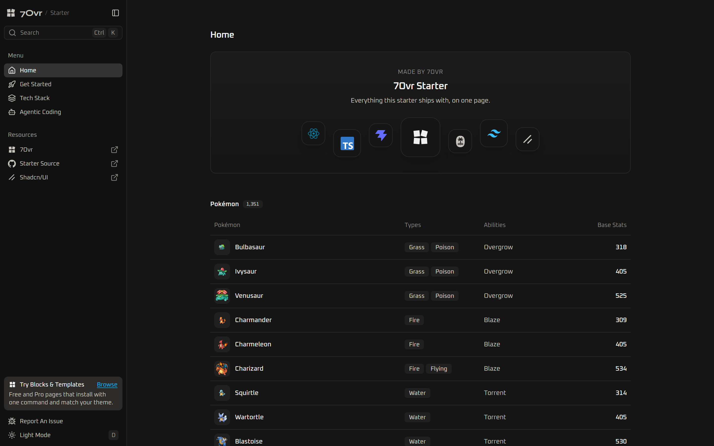

<div align="center">

<picture>
  <source media="(prefers-color-scheme: dark)" srcset=".github/assets/logo-dark.svg" />
  
</picture>

<h1>7Ovr Starter</h1>

<p><strong>A Vite and React starter with the whole stack already wired.</strong><br />
TanStack Router, Query, Form and Table, shadcn/ui on Base UI, strict TypeScript 7 and a test suite, inside the free 7Ovr App Shell.</p>

<p>
  <a href="https://github.com/7ovr/shadcn-vite-starter/actions/workflows/ci.yml"></a>
  <a href="LICENSE"></a>
  
  
  
  
  
</p>

<p>
  <a href="#quick-start"><strong>Quick Start</strong></a> ·
  <a href="#whats-inside"><strong>What's Inside</strong></a> ·
  <a href="#add-blocks-from-7ovr"><strong>Add Blocks</strong></a> ·
  <a href="https://7ovr.com/blocks"><strong>Browse 7Ovr Blocks</strong></a>
</p>

</div>

<br />



## Why this starter

Most starters stop at a blank page. This one ships a working app that describes itself, so every pattern you need has a live example to copy.

- **An app shell, not a blank page.** The free [7Ovr](https://7ovr.com) App Shell 1 block: a collapsible sidebar with search, a Ctrl+K command menu, light and dark themes, and a sheet on phones.
- **Data fetching done right.** Route loaders prefetch with TanStack Query, the page and page size live in the URL, and each record is cached on its own. The Home table loads from the free [PokéAPI](https://pokeapi.co).
- **Forms with real validation.** Report An Issue is a TanStack Form with a Zod schema. Errors appear after the first submit, focus moves to the first field to fix, and the issue opens prefilled on GitHub.
- **Tables that stay still.** TanStack Table with sorting, filtering and pagination. Columns keep a fixed width and drop cleanly on phones.
- **A design system that enforces itself.** [`@shadcn/lint`](https://github.com/shadcn-ui/lint) fails the build on raw colours, arbitrary values and restyled components.
- **Checked on every commit.** Oxlint, oxfmt, TypeScript 7, Vitest and a production build run in CI; Lefthook formats and lints staged files locally. Tests never touch the network.
- **Ready for coding agents.** `CLAUDE.md` holds every convention, `AGENTS.md` points to it, and four vendored skills keep Claude Code, Codex and Cursor on pattern.

## Quick start

You need Node 24 or newer and [pnpm](https://pnpm.io) 12 or newer.

```bash
git clone https://github.com/7ovr/shadcn-vite-starter
cd shadcn-vite-starter
pnpm install
pnpm dev
```

Open http://localhost:5173. Installing also sets up the Git hooks that format and lint your changes on commit.

## What's inside

| Layer    | Choice                                                          |
| -------- | --------------------------------------------------------------- |
| Build    | Vite 8                                                          |
| UI       | React 19, shadcn/ui (`base-nova` style) on Base UI              |
| Styling  | Tailwind CSS v4 with light and dark theme tokens                |
| Language | TypeScript 7 in strict mode                                     |
| Routing  | TanStack Router, file-based and code-split per route            |
| Data     | TanStack Query and Axios                                        |
| Forms    | TanStack Form with Zod validation                               |
| Tables   | TanStack Table                                                  |
| Tests    | Vitest and Testing Library                                      |
| Lint     | Oxlint with [`@shadcn/lint`](https://github.com/shadcn-ui/lint) |
| Format   | oxfmt, which also sorts imports and Tailwind classes            |
| Hooks    | Lefthook, which formats and lints staged files on commit        |

## Scripts

| Command             | What it does                                     |
| ------------------- | ------------------------------------------------ |
| `pnpm dev`          | Start the dev server, with the TanStack devtools |
| `pnpm build`        | Typecheck, then build the site to `dist/`        |
| `pnpm preview`      | Serve the production build locally               |
| `pnpm test`         | Run the tests once                               |
| `pnpm test:watch`   | Run the tests and rerun them on every change     |
| `pnpm lint`         | Lint the code                                    |
| `pnpm lint:fix`     | Lint and fix what can be fixed automatically     |
| `pnpm typecheck`    | Check the types                                  |
| `pnpm format`       | Format every file                                |
| `pnpm format:check` | Check the formatting without changing files      |

CI runs `lint`, `format:check`, `typecheck`, `test` and `build` on every push and pull request.

## Project layout

```
src/
├── routes/                     One file per page
│   ├── __root.tsx              The app shell, not found page and error page
│   ├── index.tsx               Home, with the Pokémon table
│   ├── get-started.tsx         Get Started
│   ├── tech-stack.tsx          Tech Stack
│   └── agentic-coding.tsx      Agentic Coding
├── components/
│   ├── app-shell-1.tsx         The app shell, from the 7Ovr App Shell 1 block
│   ├── icons.tsx               Brand marks: 7Ovr, GitHub and the tech stack logos
│   ├── command-menu.tsx        The Ctrl+K command menu, loaded on first use
│   └── ui/                     shadcn/ui components and their variants
├── features/                   One folder per feature
│   ├── pokemon/                The Home table: API calls, queries, the fake PokéAPI for tests
│   ├── tech-stack/             The filterable Tech Stack table and its tool list
│   └── issue-form/             The Report An Issue dialog and form
├── integrations/               Axios, Query client, router, test setup
├── hooks/                      Shared React hooks: useTheme, useIsMobile and useLazyDialog
├── lib/                        Shared helpers, config, navigation, page meta and the theme
├── types/                      Type declarations for environment variables
├── route-tree.gen.ts           Generated from src/routes, do not edit
├── index.tsx                   Starts the app
└── index.css                   Tailwind and the 7Ovr theme tokens
```

## Architecture

The app is a single-page application: the server sends one HTML file and the browser handles every page from there.

**Start-up.** `src/index.tsx` renders the app with the shared Query client and router from `src/integrations/`.

**Layout.** Every page renders inside the app shell in `src/components/app-shell-1.tsx`: the sidebar with search, the pages and external resources, and the command menu on Ctrl+K. The sidebar footer and the command menu also open **Report An Issue**, a dialog that opens the matching GitHub issue form, prefilled; nothing is sent from the app. Each issue type in `src/features/issue-form/lib/issue.ts` has its form in `.github/ISSUE_TEMPLATE/`, and a test keeps the two in step. Page content sits in one centred column. The sidebar and the command menu both read their entries from `src/lib/navigation.ts`.

**Pages.** The router builds its pages from the files in `src/routes/`. Each page is its own bundle, loaded when you first visit or hover a link to it. To add a page, create a file in `src/routes/` and add it to `NAV_ITEMS` in `src/lib/navigation.ts` with a label and an icon. External links go in `RESOURCES` in the same file. Get Started demonstrates the status colour tokens, from `src/components/status-tokens.tsx`.

**Data.** Requests go through one Axios client and are cached by TanStack Query. A page's loader can start its requests before the page renders, so navigation stays instant.

**Features.** Keep each feature's API calls, queries, components and types together in `src/features/<name>/`.

### The example data

The Home route's loader starts fetching a page of Pokémon before the page renders, and TanStack Query caches every page. The page and page size live in the URL, so a shared link opens the same view. Tests run against a fake PokéAPI (`src/features/pokemon/api/fake-poke-api.ts`) and never touch the network.

To remove the example:

1. Delete `src/features/pokemon/`.
2. Remove the Pokémon section and its imports from `src/routes/index.tsx`.
3. Remove the `installFakePokeApi` import and `beforeEach` from `src/integrations/test-setup.ts`.
4. Remove the Pokémon heading check from `src/integrations/router.test.tsx`.
5. Set `VITE_API_URL`, or change the default in `src/lib/config.ts`.

## Add blocks from 7Ovr

The 7Ovr registry is already set up in `components.json`. Install any free block by name:

```bash
pnpm dlx shadcn@latest add @7ovr/hero-2
```

The source lands in `src/components/blocks/`. If the CLI asks to overwrite a file in `src/components/ui/`, answer no: this starter's copies carry their own variants. Then run `pnpm format` and import the block into a page:

```tsx
import HeroBlock from '@/components/blocks/hero-2'
```

Browse every block at [7ovr.com/blocks](https://7ovr.com/blocks).

For Pro blocks, set `REGISTRY_TOKEN` in `.env` to the token from your 7Ovr account, then install from the Pro registry:

```bash
pnpm dlx shadcn@latest add @7ovr-pro/<name>
```

## Working with coding agents

`CLAUDE.md` is the single source of truth for conventions: component patterns, the data-fetching rules, the design-system variants and the checks to run before finishing. `AGENTS.md` points every other agent to it.

Four skills are vendored into `.claude/skills/` for Claude Code and `.agents/skills/` for everything else: `vercel-react-best-practices`, `vercel-composition-patterns`, `shadcn` and `improve`. They are pinned in `skills-lock.json`.

## Environment variables

Copy `.env.example` to `.env` and fill in what you need. `.env` is ignored by Git.

| Variable         | Required | Used for                                                                     |
| ---------------- | -------- | ---------------------------------------------------------------------------- |
| `VITE_API_URL`   | No       | Where API requests go. Defaults to the PokéAPI; set `/api` for your backend. |
| `REGISTRY_TOKEN` | No       | Installing 7Ovr Pro blocks. Read by the shadcn CLI, not by the app.          |

Only variables starting with `VITE_` reach the app, as `import.meta.env.VITE_*`. They end up in the browser, so never put secrets in them.

With `VITE_API_URL=/api`, the dev server forwards every `/api` request to `http://localhost:8080`. Change the target in `vite.config.ts` if your backend runs elsewhere.

## Theme

Colours and fonts follow the 7Ovr theme: CSS variables in `src/index.css`, with a light and a dark set, Oxanium for all text (13px body size) and Syne for the 7Ovr wordmark. Status colours `success`, `warning`, `info` and `destructive` each come with a `-foreground` pair. Change them there and every component and block follows. Press `d` to switch between light and dark, or use the button at the bottom of the sidebar.

## Deploy

`pnpm build` writes a static site to `dist/`. Because pages are handled in the browser, the host must answer every path with `index.html`, or refreshing any page but the home page returns a 404:

- **Vercel**: add a `vercel.json` with `{ "rewrites": [{ "source": "/(.*)", "destination": "/index.html" }] }`.
- **Netlify**: add a `public/_redirects` file containing `/* /index.html 200`.
- **Anything else**: set up a fallback to `index.html`.

## Contributing

Issues and pull requests are welcome. Read [CONTRIBUTING.md](CONTRIBUTING.md) for the setup, the conventions and the checks to run, and report security problems privately as described in [SECURITY.md](SECURITY.md).

## License

[MIT](LICENSE). Built by [7Ovr](https://7ovr.com), where you can find more blocks and templates for this stack.
